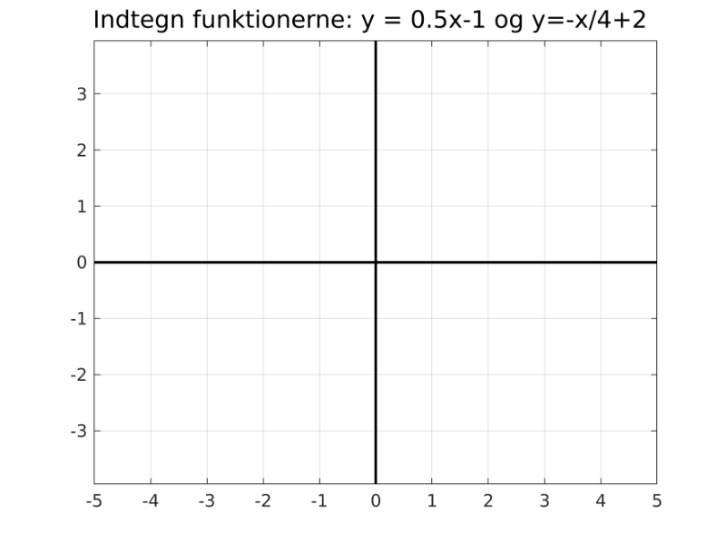
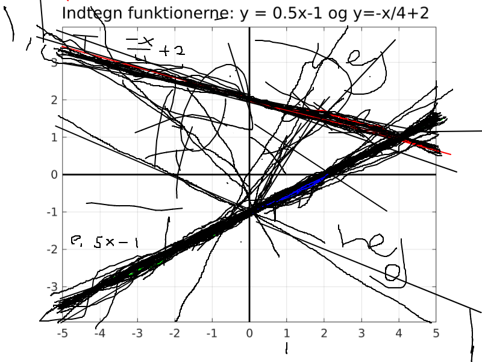
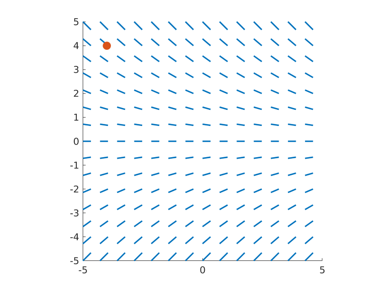
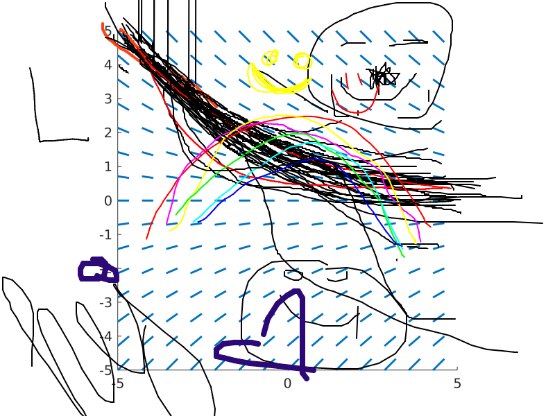
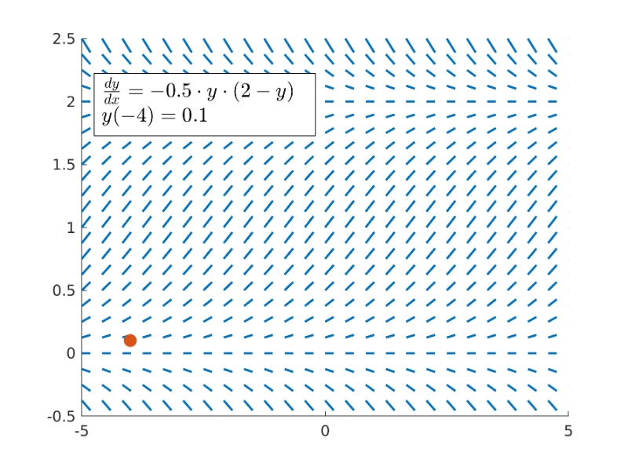
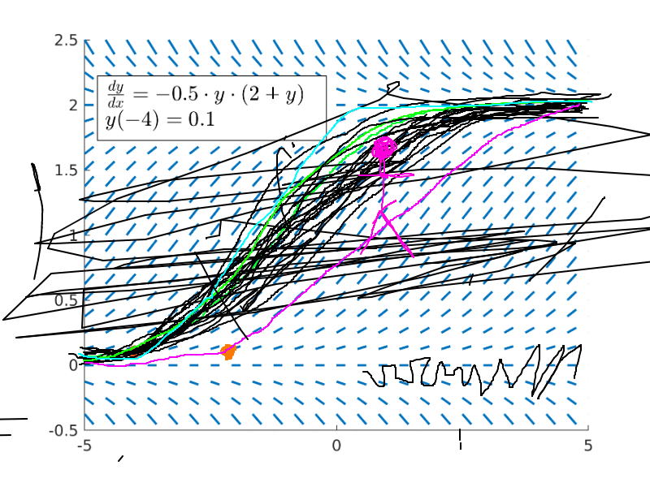

# Examples of questions and answers

Here is a small collection of graphical questions and answers obtained with the 
Classroom Shared Drawing system.

## Linear equations

## Exponential decay

## Logistic growth

