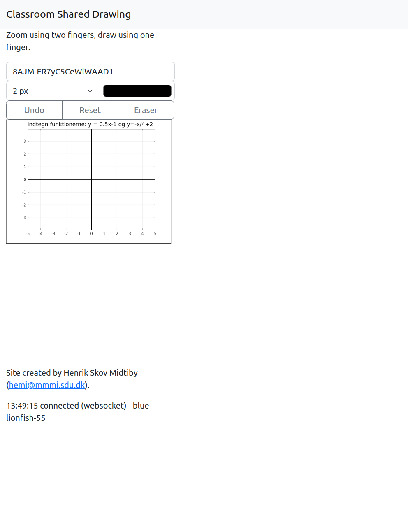

# Tutorial for Classroom Shared Drawing {#tutorial}

This tutorial will demonstrate how to use the Classroom Shared Drawing
system to push a visual question to a class, invite students into the class 
and then see how the students are answering the visual question.

The first step is to log on to the system. 
To do this head over to <https://tekvideo.sdu.dk/draw/> and use the credentials
that you have obtained for the system.
You should now see this screen.

The next step is to upload an image from your computer to use as a template for 
the students drawing. Click on *prepare question* and select the image you want 
to use.

At this point you have to choose which part of the image to use, 
in this case click on the *crop* button.

You should now see this screen, which shows the content of your private canvas 
that you will push to your class in the next step. 
If you are not satisfied with the content of the canvas you can redo the 
upload new image process.

The next step is to push the image to the class, to do that click on the 
*push private canvas to students* button in the *actions* menu.

The image has now been made available to the students in the class. 
To open the view in which the students can draw on top of the image, 
click the *Open page to share with students* button in the *Navigation* menu.
By clicking this button a page is opened (in this case 
<https://tekvideo.sdu.dk/draw/student/test5/default>) in a separate tab.
You can now share the url to this site with your class.

The student page that have been opened looks like this. 
Here the students can draw their answers to the posed question.

To make it easier to see the student answers, the *Private canvas* can be hidden.

The shared canvas is now shown as the top most element. 
This is here that all the student answers will be aggregated.

Here we have switched back to the student view and started to draw an
answer to the posed question.

In the teacher view, we can see the drawn answer immediately.

