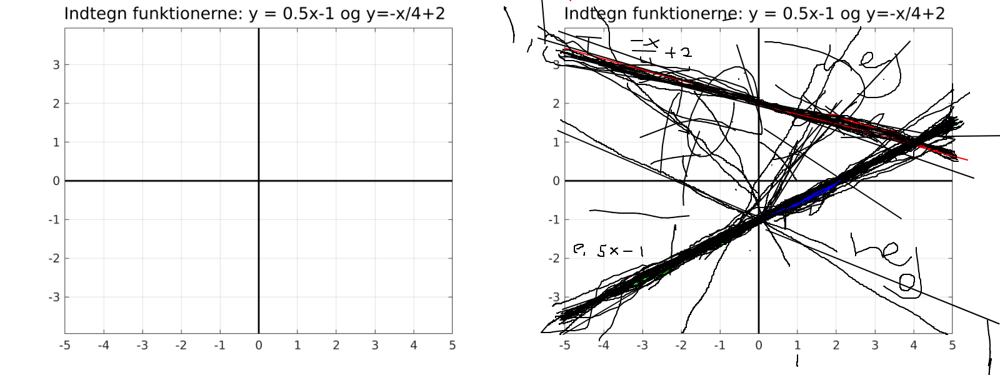

--- 
title: "Classroom Shared Drawing"
author: "Henrik Skov Midtiby"
date: "`r Sys.Date()`"
site: bookdown::bookdown_site
output: bookdown::gitbook
documentclass: book
bibliography: [book.bib, packages.bib]
biblio-style: apalike
link-citations: yes
github-repo: henrikmidtiby/using_classroom_shared_drawing
description: "This is the user manual for the Classroom Shared Drawing student response system."
---

# Preface {-}

Classroom shared drawing is a student response system based on images.
With the system, a teacher can share an image with a class and then see
where the students are drawing on top of that image.
This allows the teacher to get an insight into the students understanding 
of the current topic and often leads to interesting discussions with the 
students where identified misunderstandings can be addressed.

As an example see how students have drawn two linear equations on top of 
a coordinate system that was supplied as a template.

<iframe width="560" height="315" src="https://www.youtube.com/embed/GxKCtRBw4jQ" title="YouTube video player" frameborder="0" allow="accelerometer; autoplay; clipboard-write; encrypted-media; gyroscope; picture-in-picture; web-share" allowfullscreen></iframe>

